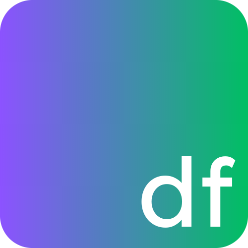

    

<h1>Danfe Programming Language</h1>

[Danfe](/)
| [Doc](/doc)
| [Language Design](#compiler-design)
| [vlang.io](https://vlang.io)

 

Danfe is a programming language that I am hacking up in my spare time. It's active on developement and will take much more time to be useable.

## Danfe Repl

